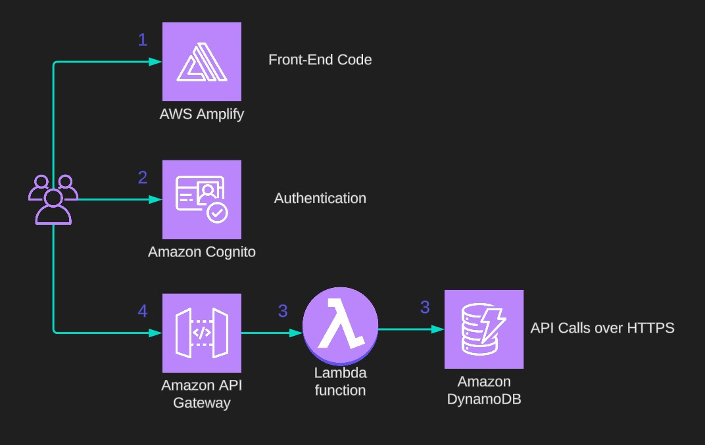
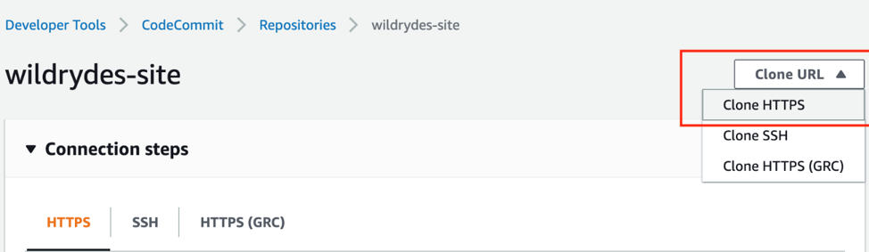
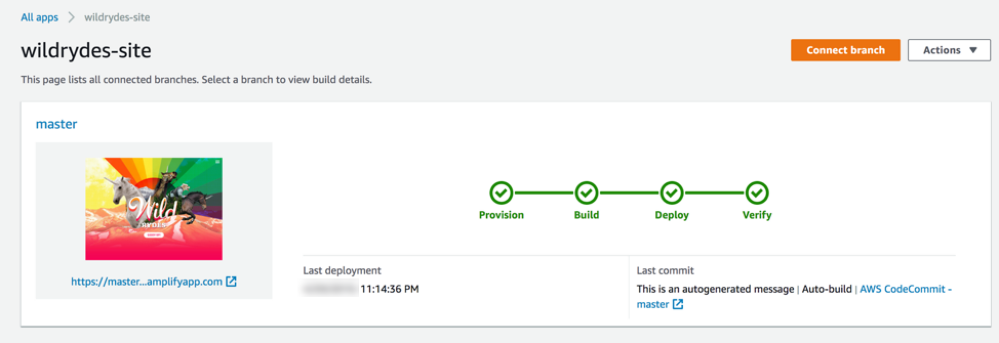
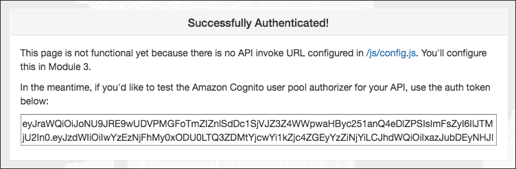

# Build a Serverless Web Application
### with AWS Lambda, Amazon API Gateway, AWS Amplify, Amazon DynamoDB, and Amazon Cognito

In this technical walkthrough, we will create a simple serverless web application that enables users to request car rides from the "Wild Rydes" (Uber-like) fleet. The application will present users with a pre-built HTML-based user interface for indicating the location where they would like to be picked up and will interact with a RESTful web service on the backend to submit the request and dispatch a nearby car ride. The application will also provide facilities for users to register with the service and log in before requesting rides.

### Prerequisites

To complete this tutorial, you will need an AWS account, AWS CLI installed in your local terminal (with "aws configure" already 
set up), an account with [ArcGIS](https://www.arcgis.com/sharing/rest/oauth2/authorize?client_id=arcgisonline&response_type=token&display=default&state=%7B%22portalUrl%22%3A%22https%3A%2F%2Fwww.arcgis.com%22%2C%22useLandingPage%22%3Atrue%2C%22clientId%22%3A%22arcgisonline%22%7D&expiration=20160&locale=en-us&redirect_uri=https%3A%2F%2Fwww.arcgis.com%2Fhome%2Faccountswitcher-callback.html&force_login=true&hideCancel=true&showSignupOption=true&canHandleCrossOrgSignIn=true&signuptype=esri&redirectToUserOrgUrl=true&allow_verification=true) to add mapping to your app, a text editor, and a web browser.

### Application architecture



- Amplify Console provides continuous deployment and hosting of the static web resources including HTML, CSS, JavaScript, and image files which are loaded in the user's browser.
- JavaScript executed in the browser sends and receives data from a public backend API built using Lambda and API Gateway.
- Amazon Cognito provides user management and authentication functions to secure the backend API. 
- DynamoDB provides a persistence layer where data can be stored by the API's Lambda function.

## Step 1 - Host a Static Website

The architecture for this module is straightforward. All of your static web content including HTML, CSS, JavaScript, images, and other files will be managed by AWS Amplify Console. For most real applications you'll want to use a custom domain to host your site. However, for the sake of this tutorial, we shall use URL exposed by AWS Amplify.

### Create a Git Repository on CodeCommit

- Open the AWS CodeCommit in AWS Management console.
- Create a new repository called "wildrydes-site".
- Once repository is created, set up an IAM user with Git credentials in the IAM console. Follow the instructions for Step 1 through Step 3 on the [Setup for HTTPS users using Git credentials page.](https://docs.aws.amazon.com/codecommit/latest/userguide/setting-up-gc.html#setting-up-gc-account) Download or save these generated credentials as well.
- In your newly created GitCommit repository, select Clone HTTPS from the Clone URL dropdown to copy the HTTPS URL.



- From your terminal window run git clone and paste the HTTPS URL of the repository. You will be prompted to enter the username and password of the Git Credentials you generated.
- Enter the below in your terminal. This is essentially copying all the frontend content from a public S3 bucket into your repository.

```bash
cd wildrydes-site
aws s3 cp s3://wildrydes-eu-central-1/WebApplication/1_StaticWebHosting/website ./ --recursive
```

- Now just like GitHub, we will add, commit and push our code to the remote repository.

```bash
$ git add .
$ git commit -m "new files"
$ git push
```

### Enable Web Hosting with AWS Amplify Console

Next you will use the AWS Amplify Console to deploy the website you've just committed to git. 

- Launch the AWS Amplify console. 
- Under the Amplify Hosting Host your web app header, choose Get Started. Select AWS CodeCommit and choose Continue.
- On the Add repository branch step, select wildrydes-site from the dropdown menu. In the Branch dropdown select master and choose Next. 
- On the Build settings page, leave all the defaults, select Allow AWS Amplify to automatically deploy all files hosted in your project root directory and choose Next. On the Review page select Save and deploy.
- Once the build is completed, select the site image, or the link underneath the thumbnail to launch your Wild Rydes site. If you select the link for master you'll see the build and deployment details related to your branch. 



The awesome feature of AWS Amplify is the automatic deployment in case you make any changes to the code in your repository and push it CodeCommit.

## Step 2 - Manage Users with Amazon Cognito

When users visit your website they will first register a new user account. For the purposes of this tutorial we'll only require them to provide an email address and password to register. After users submit their registration, Amazon Cognito will send a confirmation email with a verification code to the address they provided. These are some of the many authentication features provided by the Amazon Cognito service.

Amazon Cognito provides two different mechanisms for authenticating users. You can use Cognito User Pools to add sign-up and sign-in functionality to your application or use Cognito Identity Pools to authenticate users through social identity providers such as Facebook, Twitter, or Amazon, with SAML identity solutions, or by using your own identity system. For this tutorial we shall use a user pool as the backend for the provided registration and sign-in pages.

### Create an Amazon Cognito user pool and integrate an app with your user pool

- In the Amazon Cognito console, choose Create user pool.
- On the "Configure sign-in experience" page, in the "Cognito user pool sign-in options" section, select User name. Everything else will be default. Choose Next.
- On the "Configure security requirements" page, keep the Password policy mode as Cognito defaults. Choose No MFA. Choose Next.
- On the "Configure sign-up experience" page, keep everything as default. Choose Next.
- On the "Configure message delivery" page, for Email provider, confirm that "Send email with Cognito" is selected. (Use Amazon SES for production workloads)
- On the "Integrate your app" page, name your user pool: WildRydes. Under Initial app client, name the app client: "WildRydesWebApp" and keep the other settings as default.
- On the Review and create page, choose Create user pool.
- On the User pools page, select the User pool name to view detailed information about the user pool you created. Copy the User Pool ID in the User pool overview section and save it in a secure location on your local machine. 
- Select the App Integration tab and copy and save the Client ID in the App clients and analytics section of your newly created user pool.

### Update the website config file

- From your local machine, open the wildryde-site/js/config.js file in a text editor of your choice.
- Update the cognito section of the file with the correct values for the User pool ID and App Client ID you saved in the previous section.

The updated config.js file should look like the following code. Note that the actual values for your file will be different:

```bash
window._config = {
    cognito: {
        userPoolId: 'us-west-2_uXboG5pAb', // e.g. us-east-2_uXboG5pAb
        userPoolClientId: '25ddkmj4v6hfsfvruhpfi7n4hv', // e.g. 25ddkmj4v6hfsfvruhpfi7n4hv
        region: 'us-west-2' // e.g. us-east-2
    },
    api: {
        invokeUrl: '' // e.g. https://rc7nyt4tql.execute-api.us-west-2.amazonaws.com/prod',
    }
};
```

- Save the modified file.
- In your terminal window, add, commit, and push the file to your Git repository to have it automatically deploy to Amplify Console.

```bash
$ git add .
$ git commit -m "new_config"
$ git push
```

### Validate your implementation

- In a Finder window or Windows File Explorer, navigate to the wildrydes-site folder you copied to your local machine in Module 1.
- Open /register.html, or choose the **Giddy Up!** button on the homepage (index.html page) of your site.
- Complete the registration form and choose Let's Ryde. You can use your own email. Make sure to choose a password that contains at least one upper-case letter, a number, and a special character. Will will need the password to login later.
- You can complete the account verification process by visiting <your amplify URL>/verify.html under your website domain and entering the verification code that is emailed to you. Verification code is only applicale if Amazon SES is used so we may not get any code for our scenario.
- After confirming the new user using either the /verify.html page or the Cognito console, visit /signin.html and log in using the email address and password you entered during the registration step.
- If successful you should be redirected to /ride.html. You should see a notification that the API is not configured.

Important: Copy and save the auth token in order to create the Amazon Cognito user pool authorizer in the next module.



## Step 3 - Serverless Service Backend

In this module, you will use AWS Lambda and Amazon DynamoDB to build a backend process for handling requests for your web application. The browser application that you deployed in the first module allows users to request that a car ride be sent to a location of their choice.

You will implement a Lambda function that will be invoked each time a user requests a unicorn. The function will select a unicorn from the fleet, record the request in a DynamoDB table, and then respond to the frontend application with details about the unicorn being dispatched.

The function is invoked from the browser using Amazon API Gateway. You'll implement that connection in the next module. For this module, you will just test your function in isolation.

### Create an Amazon DynamoDB table

- In the Amazon DynamoDB console, choose Create table. For the Table name, enter "Rides".
- For the Partition key, enter "RideId" and select String for the key type. This field is case sensitive. In the Table settings section, ensure Default settings is selected, and choose Create table. 
- In the Overview tab > General Information section of your new table and choose Additional info. Copy the ARN. You will use this in the next section.

### Create an IAM role for your Lambda function

Every Lambda function has an IAM role associated with it. This role defines what other AWS services the function is allowed to interact with. For the purposes of this tutorial, you'll need to create an IAM role that grants your Lambda function permission to write logs to Amazon CloudWatch Logs and access to write items to your DynamoDB table.

- In the IAM console, select Roles in the left navigation pane and then choose Create Role.
- In the Trusted Entity Type section, select AWS service. For Use case, select Lambda, then choose Next. 
- Select "AWSLambdaBasicExecutionRole" in the filter text box and choose Next. Enter "WildRydesLambda" for the Role Name. Keep the default settings for the other parameters. Choose Create Role.
- In the filter box on the Roles page type WildRydesLambda and select the name of the role you just created.
- On the Permissions tab, under Add permissions, choose Create Inline Policy.
- In the Select a service section, type DynamoDB into the search bar, and select DynamoDB when it appears.
- Choose Select actions.
- In the Actions allowed section, type "PutItem" into the search bar and select the checkbox next to PutItem when it appears.
- In the Resources section, with the Specific option selected, choose the Add ARN link.
- Select the Text tab. Paste the ARN of the table you created in DynamoDB in the previous section, and choose Add ARNs.
- Choose Next. Enter DynamoDBWriteAccess for the policy name and choose Create policy.

### Create a Lambda function for handling requests

In this step you'll build the core function that will process API requests from the web application to dispatch a unicorn. In the next module you'll use Amazon API Gateway to create a RESTful API that will expose an HTTP endpoint that can be invoked from your users' browsers. You'll then connect the Lambda function you create in this step to that API in order to create a fully functional backend for your web application.

- From the AWS Lambda console, choose Create a function.
- Keep the default Author from scratch card selected. Enter "RequestUnicorn" in the Function name field.
- Select Node.js 16.x for the Runtime (newer versions of Node.js will not work in this tutorial).
- Select Use an existing role from the Change default execution role dropdown.
- Select WildRydesLambda from the Existing Role dropdown.
- Click on Create function.
- Scroll down to the Code source section and replace the existing code in the index.js code editor with the contents of requestUnicorn.js. The following code block displays the requestUnicorn.js file. Copy and paste this code into the index.js tab of the code editor. Remember to click Deploy right after.

```bash
const randomBytes = require('crypto').randomBytes;
const AWS = require('aws-sdk');
const ddb = new AWS.DynamoDB.DocumentClient();

const fleet = [
    {
        Name: 'Angel',
        Color: 'White',
        Gender: 'Female',
    },
    {
        Name: 'Gil',
        Color: 'White',
        Gender: 'Male',
    },
    {
        Name: 'Rocinante',
        Color: 'Yellow',
        Gender: 'Female',
    },
];

exports.handler = (event, context, callback) => {
    if (!event.requestContext.authorizer) {
      errorResponse('Authorization not configured', context.awsRequestId, callback);
      return;
    }

    const rideId = toUrlString(randomBytes(16));
    console.log('Received event (', rideId, '): ', event);

    // Because we're using a Cognito User Pools authorizer, all of the claims
    // included in the authentication token are provided in the request context.
    // This includes the username as well as other attributes.
    const username = event.requestContext.authorizer.claims['cognito:username'];

    // The body field of the event in a proxy integration is a raw string.
    // In order to extract meaningful values, we need to first parse this string
    // into an object. A more robust implementation might inspect the Content-Type
    // header first and use a different parsing strategy based on that value.
    const requestBody = JSON.parse(event.body);

    const pickupLocation = requestBody.PickupLocation;

    const unicorn = findUnicorn(pickupLocation);

    recordRide(rideId, username, unicorn).then(() => {
        // You can use the callback function to provide a return value from your Node.js
        // Lambda functions. The first parameter is used for failed invocations. The
        // second parameter specifies the result data of the invocation.

        // Because this Lambda function is called by an API Gateway proxy integration
        // the result object must use the following structure.
        callback(null, {
            statusCode: 201,
            body: JSON.stringify({
                RideId: rideId,
                Unicorn: unicorn,
                Eta: '30 seconds',
                Rider: username,
            }),
            headers: {
                'Access-Control-Allow-Origin': '*',
            },
        });
    }).catch((err) => {
        console.error(err);

        // If there is an error during processing, catch it and return
        // from the Lambda function successfully. Specify a 500 HTTP status
        // code and provide an error message in the body. This will provide a
        // more meaningful error response to the end client.
        errorResponse(err.message, context.awsRequestId, callback)
    });
};

// This is where you would implement logic to find the optimal unicorn for
// this ride (possibly invoking another Lambda function as a microservice.)
// For simplicity, we'll just pick a unicorn at random.
function findUnicorn(pickupLocation) {
    console.log('Finding unicorn for ', pickupLocation.Latitude, ', ', pickupLocation.Longitude);
    return fleet[Math.floor(Math.random() * fleet.length)];
}

function recordRide(rideId, username, unicorn) {
    return ddb.put({
        TableName: 'Rides',
        Item: {
            RideId: rideId,
            User: username,
            Unicorn: unicorn,
            RequestTime: new Date().toISOString(),
        },
    }).promise();
}

function toUrlString(buffer) {
    return buffer.toString('base64')
        .replace(/\+/g, '-')
        .replace(/\//g, '_')
        .replace(/=/g, '');
}

function errorResponse(errorMessage, awsRequestId, callback) {
  callback(null, {
    statusCode: 500,
    body: JSON.stringify({
      Error: errorMessage,
      Reference: awsRequestId,
    }),
    headers: {
      'Access-Control-Allow-Origin': '*',
    },
  });
}
```

## Step 4 - Deploy a RESTful API

You will use Amazon API Gateway to expose the Lambda function you built in the previous module as a RESTful API.

### Create a new REST API and Authorizer

- In the Amazon API Gateway console, select APIs in the left navigation pane. Choose Build under REST API. In the Choose the protocol section, select REST. 
- In the Create new API section, select New API.
- In the Settings section, enter WildRydes for the API Name and select Edge optimized in the Endpoint Type dropdown.
- Choose Create API.
- In the left navigation pane of the WildRydes API you just created, select Authorizers. Choose Create New Authorizer. Enter WildRydes into the Authorizer Name field.
- Select Cognito as the Type. 
- Under Cognito User Pool, in the Region drop-down, select the same Region you have been using for the rest of the tutorial. Enter WildRydes in the Cognito User Pool name field. 
- Enter Authorization for the Token Source. Choose Create. 

### Create a new resource and method

In this section you will create a new resource within your API. Then create a POST method for that resource and configure it to use a Lambda proxy integration backed by the RequestUnicorn function you created in the first step of this module.

- In the left navigation pane of your WildRydes API, select Resources. From the Actions dropdown, select Create Resource.
- Enter ride as the Resource Name, which will automatically create the Resource Path /ride.
- Select the checkbox for Enable API Gateway CORS. Choose Create Resource.
- With the newly created /ride resource selected, from the Actions dropdown select Create Method.
- Select POST from the new dropdown that appears under OPTIONS, then select the checkmark icon.
- Select Lambda Function for the Integration type. Select the checkbox for Use Lambda Proxy integration.
- Select the same Region you have been using throughout the tutorial for Lambda Region.
- Enter RequestUnicorn for Lambda Function. Choose Save.
- When prompted to give Amazon API Gateway permission to invoke your function, choose OK.
- Select the Method Request card. Choose the pencil icon next to Authorization.
- Select the WildRydes Cognito user pool authorizer from the drop-down list, and select the checkmark icon.

### Deploy your API

- In the Actions drop-down list select Deploy API.
- Select [New Stage] in the Deployment stage drop-down list.
- Enter "prod" for the Stage Name.
- Choose Deploy.
- Copy the Invoke URL. You will use it in the next section.

### Update the website config again

- On your local machine, navigate to the js folder, and open the config.js file in a text editor of your choice
- Paste the Invoke URL you copied from the Amazon API Gateway console in the previous section into the invokeUrl value of the config.js file. 
- Save the file.

See the following example of a completed config.js file. Note, the actual values in your file will be different

```bash
window._config = {

    cognito: {

        userPoolId: 'us-west-2_uXboG5pAb', // e.g. us-east-2_uXboG5pAb         

        userPoolClientId: '25ddkmj4v6hfsfvruhpfi7n4hv', // e.g. 25ddkmj4v6hfsfvruhpfi7n4hv

        region: 'us-west-2' // e.g. us-east-2 

    }, 

    api: { 

        invokeUrl: 'https://rc7nyt4tql.execute-api.us-west-2.amazonaws.com/prod' // e.g. https://rc7nyt4tql.execute-api.us-west-2.amazonaws.com/prod, 

    } 

};
```

- Add, commit, and push the updated config.js file to your Git repository to have it automatically deploy to Amplify Console.

```bash
$ git add .
$ git commit -m "new_configuration"
$ git push
```

### Check if your Web Application works! Finally!

- Visit /ride.html under your website domain.
- If you are redirected to the ArcGIS sign-in page, sign in with the user credentials you created previously in the Introduction section as a prerequisite of this tutorial.
- After the map has loaded, click anywhere on the map to set a pickup location.
- Choose Request Unicorn. You should see a notification in the right sidebar that a unicorn is on its way and then see a unicorn icon fly to your pickup location.
- Choose rides multiple times and see how entries for new drivers also populate DynamoDB table. These drivers names appear in the lambda function.


